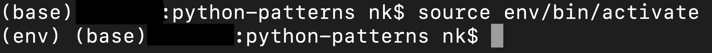
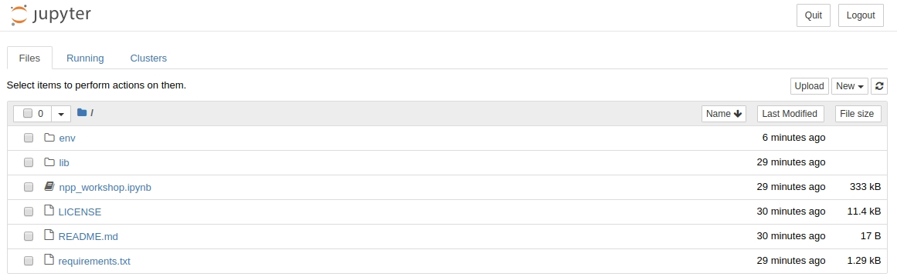
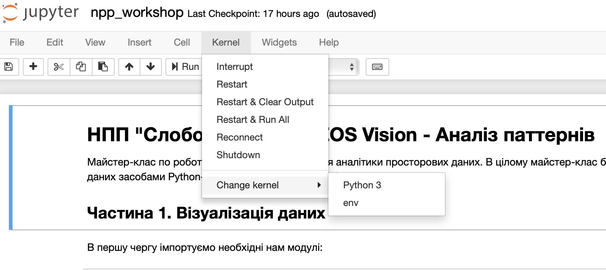

# python-patterns

Набір інструментів для роботи з просторовими даними, використовуючи Python, а саме - Python Notebook.

## Початок роботи

1. Для початку роботи необхідно [встановити Python версії 3.6 і вище](https://www.python.org/). 


Якщо він уже встановлений, то етап можна пропустити. Єдине, на що варто звернути увагу - якщо встановлені і python2.+, i python3.+, то, скоріш за все, функція виклику python версії 3.+ буде `python3`. 

Рекомендується оновити `pip` командою `pip install --upgrade pip` або `python -m pip install --upgrade pip`


2. Наступним етапом буде завантаження файлів даного проекту (клік на завантажити, або клонування його)
3. Далі - перехід в папку з проектом, використовуючи термінал чи командну стрічку, наприклад:

`
cd Desktop/python-patterns
`
_- зверніть увагу, що у Windows використовується знак `\` в ролі розділювача папок_

4.0 Встановлюємо інструмент створення **virtual environment**: 

`apt-get install python3-venv` - Linux, Mac

`pip install virtualenv` - Windows

4.1 Уже всередині папки створюємо **virtual environment**:

`python -m venv env` - Linux, Mac

`virtualenv venv` - Windows

5. Активуємо його:
```
source env/bin/activate
```

На даному етапі всі виклики python мають відбуватися з даного **virtual environment**. У командній стрічці (терміналі) має бути вказано `(env)` на початку.


Для перевірки пишемо `which python` і маємо побачити щось в такому форматі `/home/username/Desktop/python-patterns/env/bin/python`

6. Встановлюємо всі потрібні модулі:
```
pip install -r requirements.txt
```

_Це може зайняти певний час_

Для перевірки правильного встановлення середовища Jupyter пишемо `which jupyter` і маємо побачити шлях до нашого середовища `/home/username/Desktop/python-patterns/env/bin/jupyter`

7. Вказуємо Jupyter'у звідки йому брати всі модулі при його роботі
```
python -m ipykernel install --user --name env
```

8. Запускаємо Jupyter Notebook: `jupyter-notebook` (або Jupyter lab (`jupyter-lab`)) та обираємо `env` у ролі кернела


Має запуститися головне вікно Jupyter:





Якщо програма не пропонує обрати кернел при вході, заходимо в документ npp_workshop.ipynb, відкриваємо вкладку `Kernel` -> `Change kernel` -> `env`


